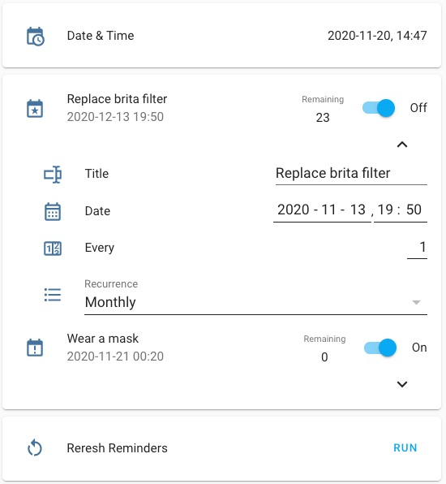

## How it works

**THIS IS INITIAL VERSION, NOT FULLY TESTED YET!!!**

*Please :star: this repo if you find it useful*

<p align="left"><br>
<a href="https://paypal.me/eyalco1967?locale.x=he_IL" target="_blank"></a>
</p>

A python script for Home Assistant that counts down the days to a reminder. On the day of the reminder, the remminder state will be changed to 'on' state.

[See it on YouTube](https://youtu.be/XYYp_4XGPl4 "Reminders")

**Note** In 0.118 there is an issue with local / utc time, so until it will be fixed, current local time is taken from the sensor `sensor.date_time` which should exists

## Script arguments
key | required | type | description
-- | -- | -- | --
`name` | True | string | Name of the date (eg. John Birthday)
`icon_on` | False | string | Icon when reminder has on state (default mdi:calendar-alert)
`icon_off` | False | string | Icon when reminder has off state (default mdi:calendar-star)
`date` | True | date | Date, in format YYYY-MM-DD-MM HH:MM (time is optional)
`title` | False | string | Reminder title (will be used as the friendly name, default 'Reminder')
`recurrence` | False | string | yearly, montly, daily, does not repeat (default 'yearly')
`duration` | False | number | Reminder duration ('on' state) in hours (default 0)
`every` | False | number | Multiple of the recurrence period
`tag` | False | string | Tag
`notifier` | False | string | Notifer to call when reminder occurs
`script` | False | string | Script to execute when reminder occurs
`message` | False | string | Notifier / script message (default reminder title)

## Usage

examples:

```
name: John Birthday
date: 05-10-1985
title: John birthday
tag: birthday
```

or

```
name: Replace brita filter
date: 06-11-2020 08:00
recurrence: monthly
notifier: telegram_bot
```

or

```
name: Buy new running shoes
date: 01-10-2020 08:00
recurrence: monthly
every: 6
notifier: telegram_bot
```

## Generated sensors
Each sensor is given the following automatically:

```
entity_id: sensor.<name>
friendly_name: <title>
state: <on/off>
icon: <icon>
friendly_date: <YYYY-MM-DD HH:MM>
remaining: <Remaning days to occurence>
tag: <tag>
```

## Example configuration.yaml entry
An example automation to create and refresh the above three sensors daily would be:

```yaml
automation:
  - alias: Reminder refresh
    trigger:
      - platform: time_pattern
        minutes: 1
      - platform: homeassistant
        event: start
    action:
      - service: python_script.set_reminder
        data:
          name: John birthday
          date: "05-10-1985"
          title: John birthday
          tag: birthday
```

## Example Lovelace representation

```yaml
type: entities
show_header_toggle: false
title: Reminders
entities:
  - entity: sensor.john_birthday
```

## Advance Example

The following configuration can be used to have UI configurable reminder.



```yaml
input_select:
  reminder1_recurrence:
    name: Recurrence
    options:
      - Does not repeat
      - Daily
      - Weekly
      - Monthly
      - Yearly
```

```yaml
input_number:
  reminder1_every:
    name: Every
    icon: mdi:counter
    min: 1
    max: 100
    step: 1
    mode: box
```

```yaml
input_datetime:
  reminder1_date:
    name: Date
    has_date: true
    has_time: true
    icon: mdi:calendar-month-outline
```

```yaml
input_boolean:
  reminder1_enable:
    name: Enable
    icon: mdi:calendar-blank
```

```yaml
input_text:
  reminder1_title:
    name: Title
    max: 32
```

```yaml
script:
  reminder_refresh:
    sequence:
      - service: python_script.set_reminder
        data:
          name: reminder1
          recurrence: "{{ states('input_select.reminder1_recurrence') }}"
          every: "{{ states('input_number.reminder1_every') | int }}"
          title: "{{ states('input_text.reminder1_title') }}"
          date: "{{ as_timestamp(states('input_datetime.reminder1_date')) | timestamp_local }}"
          enable: "{{ states('input_boolean.reminder1_enable') }}"
```

```yaml
decluttering_templates:
  template_reminder_card:
    card:
      type: entity-filter
      state_filter:
        - "on"
      entities:
        - entity: input_boolean.[[name]]_enable
      show_empty: false
      card:
        type: vertical-stack
        cards:
          - type: custom:multiple-entity-row
            entity: sensor.[[name]]
            secondary_info:
              attribute: friendly_date
            entities:
              - attribute: remaining
                name: Remaining
              - entity: input_boolean.[[name]]_enable
                toggle: true
                name: false
          - type: custom:fold-entity-row
            head:
              type: divider
              label: padding
              style:
                background-color: var(--background-card-color)
            padding: 20
            entities:
              - entity: input_text.[[name]]_title
              - entity: input_datetime.[[name]]_date
              - entity: input_number.[[name]]_every
              - entity: input_select.[[name]]_recurrence
```

```yaml
.
. (cards)
.
      - type: vertical-stack
        cards:
          - type: entities
            entities:
              - sensor.date_time
          - type: entities
            entities:
              - type: custom:decluttering-card
                template: template_reminder_card
                variables:
                  - name: reminder1
      - type: entity-filter
        state_filter:
          - "off"
        show_empty: false
        entities:
          - entity: input_boolean.reminder1_enable
        card:
          show_header_toggle: false
```

## Todo

- Add weekly support (not implemented yet)

---

I put a lot of work into making this repo and component available and updated to inspire and help others! I will be glad to receive thanks from you — it will give me new strength and add enthusiasm:
<p align="center"><br>
<a href="https://paypal.me/eyalco1967?locale.x=he_IL" target="_blank"></a>
</p>